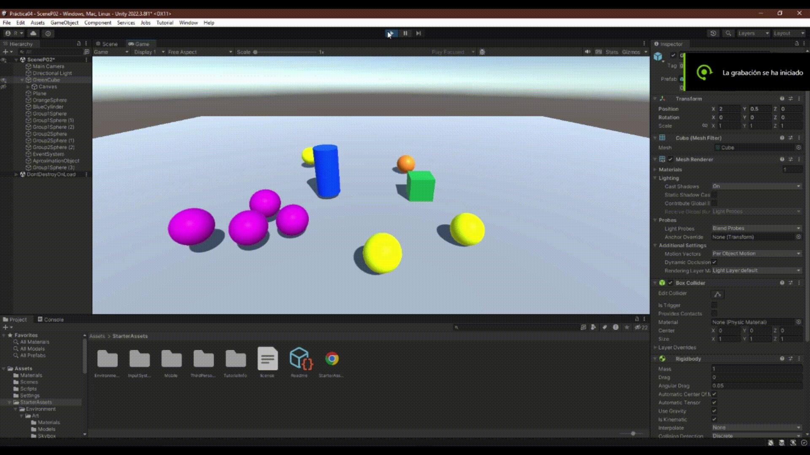
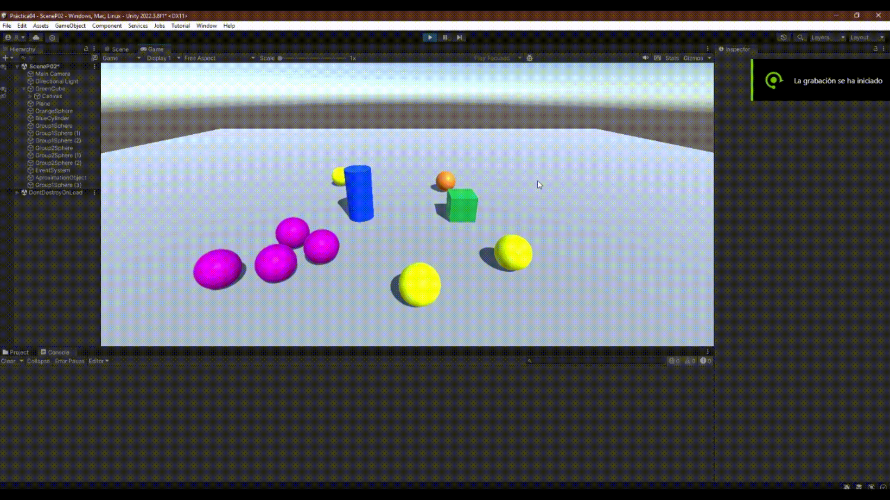

# II-Raimon-Mejias-P04-Eventos
Repositorio que contiene los scripts realizados y un README con la descripción del trabajo de la práctica

## Descripción del trabajo realizado

### Ejercicio 01

Se nos pide realizar un script que tras colisionar el cubo con el cilindro: las esferas del grupo1 cambien de color, mientras que las del grupo 2 sean impulsadas hacia el cilindro

Para ello se hace uso de 3 scripts distintos:

#### Script CubeMovement

Script básico que permite mover el cubo por el plano 

```C#
    public float speed = 1.0f;
    void Update()
    {
        float movement = speed * Time.deltaTime;
        transform.Translate(
            movement * Input.GetAxis("Horizontal"), 
            0, 
            movement * Input.GetAxis("Vertical")
        );
    }
```

#### Script CubeNotificator

Script que realiza la función de notificador para el resto de la práctica, indicando contra que ha colisionado el cubo y lanzando el correspondiente evento

```C#
    public delegate void Message();
    public event Message OnColissionWithCylinder = delegate { };

    void OnCollisionEnter(Collision other) {
        GameObject target = other.collider.gameObject;
        switch (target.tag)
        {
            case "blue_cylinder": OnColissionWithCylinder(); break;
            default:              break;
        }
    }
```
La estructura del código se ha realizado con el objetivo de poder ampliarlo a lo largo de la práctica

#### Script EventReceiver

Script que realiza la función de recolector de eventos, ejecutando los correspondientes códigos dependiendo del evento

```C#
    CubeNotificator cubeNotificator;
    GameObject targetObject;
    public float speed = 5.0f;

    // Start is called before the first frame update
    void Start()
    {
        cubeNotificator = GameObject.FindWithTag("green_cube").GetComponent<CubeNotificator>();
        targetObject = GameObject.FindWithTag("blue_cylinder");
        cubeNotificator.OnColissionWithCylinder += CylinderRespond;
    }

    void CylinderRespond() {
        if (tag == "group1") { ChangeToRandomColor(); }
        else if (tag == "group2") { MoveToTarget(); }
    }

    void MoveToTarget() {
        Vector3 targetPosition = targetObject.transform.position;
        Vector3 movement = (targetPosition - transform.position).normalized;
        GetComponent<Rigidbody>().AddForce(movement * speed, ForceMode.Impulse);               
    }

    void ChangeToRandomColor() {
        GetComponent<Renderer>().material.color = 
                new Vector4(UnityEngine.Random.value, UnityEngine.Random.value, UnityEngine.Random.value, 1);  
    }
```



### Ejercicio 02

Se nos pide ampliar el código generado en el ejercicio anterior para añadir la siguiente funcionalidad: 
Cuando el cubo colisiona con cualquier objeto que no sean esferas del grupo 1, las esferas en el grupo 1 se acercan al cilindro. Cuando el cubo toca cualquier esfera del grupo 1, las esferas del grupo 2 aumentan de tamaño.

#### Ampliación de CubeNotificator

```C#
    public delegate void Message();
    public event Message OnColissionWithCylinder = delegate { };
    public event Message OnColissionWithAny = delegate { };
    public event Message OnColissionWithGroup1 = delegate { };

    void OnCollisionEnter(Collision other) {
        GameObject target = other.collider.gameObject;
        switch (target.tag)
        {
            case "group1":        OnColissionWithGroup1(); break;
            case "group2":        OnColissionWithAny(); break;
            case "blue_cylinder": OnColissionWithCylinder(); break;
            default:              OnColissionWithAny(); break;
        }
    }
```

#### Ampliación de EventReceiver

```C#
    CubeNotificator cubeNotificator;
    GameObject targetObject;
    public float speed = 5.0f;

    // Start is called before the first frame update
    void Start()
    {
        cubeNotificator = GameObject.FindWithTag("green_cube").GetComponent<CubeNotificator>();
        targetObject = GameObject.FindWithTag("blue_cylinder");
        if (tag == "group1") { cubeNotificator.OnColissionWithAny += AnyRespond; }
        if (tag == "group2") { cubeNotificator.OnColissionWithGroup1 += Group1Respond; }
        cubeNotificator.OnColissionWithCylinder += CylinderRespond;
    }

    void CylinderRespond() {
        if (tag == "group1") { ChangeToRandomColor(); }
        else if (tag == "group2") { MoveToTarget(); }
    }

    void AnyRespond() { MoveToTarget(); }

    void Group1Respond() { Scalate(); }

    void Scalate() { transform.localScale += new Vector3(1, 1, 1); }
```


### Ejercicio 03

Se nos pide realizar la siguiente ampliación: 
Cuando el cubo se aproxima al cilindro, las esferas del grupo 1 cambian su color y saltan y las esferas del grupo 2 se orientan hacia un objeto ubicado en la escena con ese propósito.

#### Script Aproximation

Se genera un nuevo Script dentro de un GameObject vacío para controlar la aproximación del cubo al cilindro

```C#
    Vector3 previousPosition;
    GameObject[] group1Objects;
    GameObject[] group2Objects;
    public GameObject targetObject;
    public GameObject movingObject;
    // Start is called before the first frame update

    void Start()
    {
       group1Objects = GameObject.FindGameObjectsWithTag("group1");
       group2Objects = GameObject.FindGameObjectsWithTag("group2");
       previousPosition = movingObject.transform.position;
    }

    // Update is called once per frame
    void FixedUpdate()
    {
        Vector3 targetPosition = targetObject.transform.position;
        Vector3 movingPosition = movingObject.transform.position;
        float prevDistance = Vector3.Distance(targetPosition, previousPosition);
        float currentDistance = Vector3.Distance(targetPosition, movingPosition);
        if (currentDistance < prevDistance) {
            foreach(GameObject g1object in group1Objects) {
                if (g1object != null) {
                    Color currentColor = g1object.GetComponent<Renderer>().material.color;
                    g1object.GetComponent<Renderer>().material.color = 
                        Color.Lerp(currentColor, Color.green, Time.deltaTime);
                    if (g1object.transform.position.y <= 0.5) {
                        g1object.GetComponent<Rigidbody>().AddForce(Vector3.up * 10, ForceMode.Impulse); 
                    }
                }
            }
            foreach(GameObject g2object in group2Objects) {
                if (g2object != null) { g2object.transform.LookAt(transform); }
            }
        }        
        previousPosition = movingPosition;
    }
```



### Ejercicios 04 y 05

Se nos pide realizar los siguientes scripts 
Implementar la mecánica de recoger esferas en la escena que actualicen la puntuación del jugador. Las esferas de tipo 1 suman 5 puntos y las esferas de tipo 2 suman 10. Mostrar la puntuación en la consola.
Partiendo del script anterior crea una interfaz que muestre la puntuación que va obteniendo el cubo. 

#### Script SphereScore

Se genera un nuevo script que controla la cantidad de puntos que el cubo tiene hasta el momento, actualizando el texto y destruyendo todas las esferas con las que colisiona.

```C#
    AudioSource source;
    CubeNotificator cubeNotificator;
    int sphereScore;

    // Start is called before the first frame update
    void Start()
    {
        cubeNotificator = GameObject.FindWithTag("green_cube").GetComponent<CubeNotificator>();
        cubeNotificator.OnAddScoreGroup1 += addScore;
        cubeNotificator.OnAddScoreGroup2 += addScore;
        sphereScore = 0;
        GetComponentInChildren<TMP_Text>().text = $"{sphereScore}";
    }

    void Update() {
        GetComponentInChildren<TMP_Text>().text = $"{sphereScore}";
    }

    void addScore(int score, GameObject sphere) { 
        sphereScore += score;
        source = sphere.GetComponent<AudioSource>();
        if (source != null) { source.Play(); }
        sphere.GetComponent<Renderer>().enabled = false; 
        sphere.GetComponent<Rigidbody>().detectCollisions = false; 
        Destroy(sphere, (source != null)? source.clip.length : 0);
    }
```

#### Ampliación de CubeNotificator

Además de crear el nuevo script se debe modificar CubeNotificator para tener en cuenta la colisión contra las esferas y determinar el evento que se lanza.
Se crea un nuevo tipo de delegado, Points así como sus correspondientes eventos OnAddScoreGroupX

```C#
    public delegate void Message();
    public delegate void Points(int score, GameObject sphere);
    public event Message OnColissionWithAny = delegate { };
    public event Message OnColissionWithGroup1 = delegate { };
    public event Points  OnAddScoreGroup1 = delegate { };
    public event Points  OnAddScoreGroup2 = delegate { };
    public event Message OnColissionWithCylinder = delegate { };

    void OnCollisionEnter(Collision other) {
        GameObject target = other.collider.gameObject;
        switch (target.tag)
        {
            case "group1":        OnColissionWithGroup1(); OnAddScoreGroup1(5, target); break;
            case "group2":        OnAddScoreGroup2(10, target); OnColissionWithAny(); break;
            case "blue_cylinder": OnColissionWithCylinder(); break;
            default:              OnColissionWithAny(); break;
        }
    }
```

#### Tener en cuenta la destrucción de las Esferas 

```C#
    void OnDestroy() {
        if (gameObject == null || cubeNotificator == null) { return; }
        if (tag == "group1") { cubeNotificator.OnColissionWithAny -= AnyRespond; }
        if (tag == "group2") { cubeNotificator.OnColissionWithGroup1 -= Group1Respond; }
        cubeNotificator.OnColissionWithCylinder -= CylinderRespond;    
    }
```


### Ejercicio 06

Se nos pide realizar una nueva escena en la que utilicemos los scripts realizados para generar un prototipo


